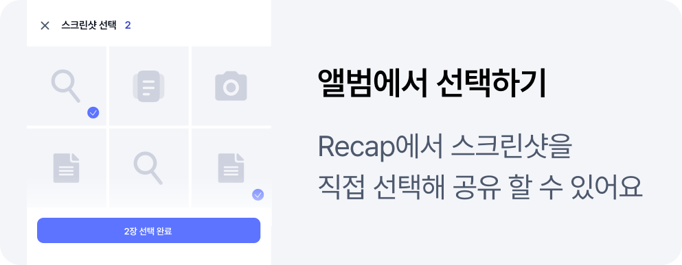
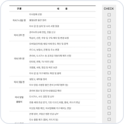
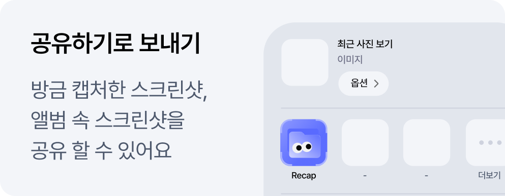

# Recap iOS

<p align="center">
  
</p>

<h3 align="center">찍기는 쉽지만, 다시 찾기는 어려운 스크린샷</h3>

<p align="center">
  Recap은 스크린샷 속 정보를 AI로 읽고<br />
  제목, 요약, 유형별 폴더로 정리해주는 iOS 앱입니다.
</p>

<p align="center">
  <a href="https://apps.apple.com/us/app/recap-%EC%8A%A4%ED%81%AC%EB%A6%B0%EC%83%B7-%EC%9A%94%EC%95%BD-%EC%A0%95%EB%A6%AC/id6795902468">
    
  </a>
</p>

앨범에 쌓여 있는 스크린샷을 필요한 만큼 선택하거나 다른 앱에서 Recap으로 공유하면, 스크린샷의 제목·요약·본문을 자동으로 생성하고 유형별 폴더에 정리합니다. 나중에는 보관함과 검색을 통해 필요한 정보를 다시 빠르게 찾을 수 있습니다.

## 화면 미리보기

<p align="center">
  
  
  
  
</p>

## 주요 기능

### 한눈에 확인하는 제목과 요약

스크린샷마다 제목과 요약을 만들어 목록에서 바로 내용을 파악할 수 있습니다. 카페 정보, 예약 일정, 상품 가격처럼 다시 확인하고 싶은 핵심 내용만 빠르게 찾아볼 수 있습니다.

### 공유 한 번으로 빠른 정리

최근에 찍은 스크린샷은 공유 시트에서 Recap을 선택해 바로 정리할 수 있습니다. 사진 보관함에서는 필요한 스크린샷만 골라 한 번에 보낼 수 있습니다.

### 유형별 보관함

스크린샷은 장소·맛집, 일정·예약, 쇼핑·상품, 정보·지식 등 정보의 성격에 따라 자동으로 분류됩니다. 여행 중 찍은 스크린샷처럼 흩어진 자료도 한 폴더에서 모아볼 수 있습니다.

### 검색과 즐겨찾기

기억나는 단어 하나만 검색해도 제목·요약·본문에 포함된 내용을 함께 찾을 수 있습니다. 계좌번호, 주소, 예약 정보처럼 자주 보는 스크린샷은 즐겨찾기에 저장해 상단에서 바로 열 수 있습니다.

### 상세 정보 편집과 데이터 관리

제목·요약·본문·유형을 직접 수정하고 원본 이미지를 확대해 확인할 수 있습니다. 카카오·Apple 로그인, AI 데이터 전송 동의 관리, 데이터 삭제, 정리 결과 신고도 지원합니다.

## 기술 스택

- Swift 6
- SwiftUI
- iOS 26.0+
- Swift Package Manager
- Alamofire — 네트워크 통신
- Kakao iOS SDK — 카카오 로그인
- Lottie — 애니메이션
- ConfettiSwiftUI — 시각 효과
- Keychain — 인증 세션 보안 저장
- iOS Share Extension — 시스템 공유 시트 연동

## 프로젝트 구조

```text
recap-iOS/
├── Recap/                    # 메인 앱
│   ├── App/                  # 앱 진입점, 라우팅, 세션 상태
│   ├── Features/             # 기능별 화면과 데이터 계층
│   │   ├── Home/             # 홈
│   │   ├── Archive/          # 보관함과 폴더
│   │   ├── Search/           # 검색
│   │   ├── CardCreation/     # 스크린샷 정리 플로우
│   │   ├── CardDetail/       # 상세 조회와 편집
│   │   ├── Onboarding/       # 온보딩과 로그인
│   │   └── Settings/         # 설정과 데이터 관리
│   ├── Services/             # 인증, 네트워크, 보안 저장소
│   ├── DesignSystem/         # 공통 컴포넌트와 디자인 토큰
│   └── Models/               # 도메인 모델
├── RecapShareExtension/      # 공유 시트에서 스크린샷을 전송하는 확장
├── Shared/                   # 앱과 Share Extension이 공유하는 UI·모델
├── RecapTests/               # 단위 테스트
├── Config/                   # 앱 설정과 로컬 시크릿 예시
└── Recap.xcodeproj/          # Xcode 프로젝트
```

## 실행 방법

### 요구 사항

- macOS
- Xcode 및 iOS 26 SDK
- iOS 26 이상을 실행하는 시뮬레이터 또는 실기기
- 프로젝트에서 사용하는 API 서버 접근 권한
- 카카오 네이티브 앱 키

### 설정

1. 저장소를 클론합니다.

   ```bash
   git clone https://github.com/Central-MakeUs/recap-iOS.git
   cd recap-iOS
   ```

2. 로컬 시크릿 설정 파일을 생성하고 카카오 앱 키를 입력합니다.

   ```bash
   cp Config/Secrets.xcconfig.example Config/Secrets.xcconfig
   ```

   ```text
   // Config/Secrets.xcconfig
   KAKAO_NATIVE_APP_KEY = <YOUR_KAKAO_NATIVE_APP_KEY>
   ```

3. `Recap.xcodeproj`를 Xcode에서 열고 `Recap` 스킴을 선택합니다.

4. 시뮬레이터 또는 연결된 기기를 선택한 후 실행합니다.

> `Config/Secrets.xcconfig`는 저장소에 커밋하지 않습니다. 카카오 로그인과 실제 인증 플로우는 실기기 검증이 필요합니다.

## 테스트

Xcode에서 `Recap` 스킴의 테스트를 실행하거나 다음 명령을 사용할 수 있습니다.

```bash
xcodebuild test \
  -project Recap.xcodeproj \
  -scheme Recap \
  -destination 'platform=iOS Simulator,name=iPhone 17 Pro'
```

릴리스 빌드와 배포 전 확인 절차는 [RELEASE.md](RELEASE.md)를 참고하세요.

## 앱 구조 개요

```text
사진 보관함 / 공유 시트
            │
            ▼
     선택한 스크린샷 확인
            │
            ▼
     AI 분석 및 정리 요청
            │
            ▼
 제목 · 요약 · 본문 · 유형 생성
            │
            ▼
      보관함 / 폴더 / 검색
```

앱과 Share Extension은 Keychain 및 App Group을 통해 인증 세션을 공유하고, 정리 작업은 공통 업로드 파이프라인을 사용합니다. 네트워크 계층은 인증 클라이언트와 API Endpoint를 분리해 구성되어 있으며, Preview와 테스트를 위한 목 구현도 제공합니다.

## 관련 링크

- [Recap iOS App Store](https://apps.apple.com/us/app/recap-%EC%8A%A4%ED%81%AC%EB%A6%B0%EC%83%B7-%EC%9A%94%EC%95%BD-%EC%A0%95%EB%A6%AC/id6795902468)
- [Recap Android Repository](https://github.com/Central-MakeUs/recap-android)

## 라이선스

프로젝트에 포함된 오픈소스 라이선스는 앱의 설정 화면과 `Recap/Resources/OpenSourceLicenses.plist`에서 확인할 수 있습니다.
