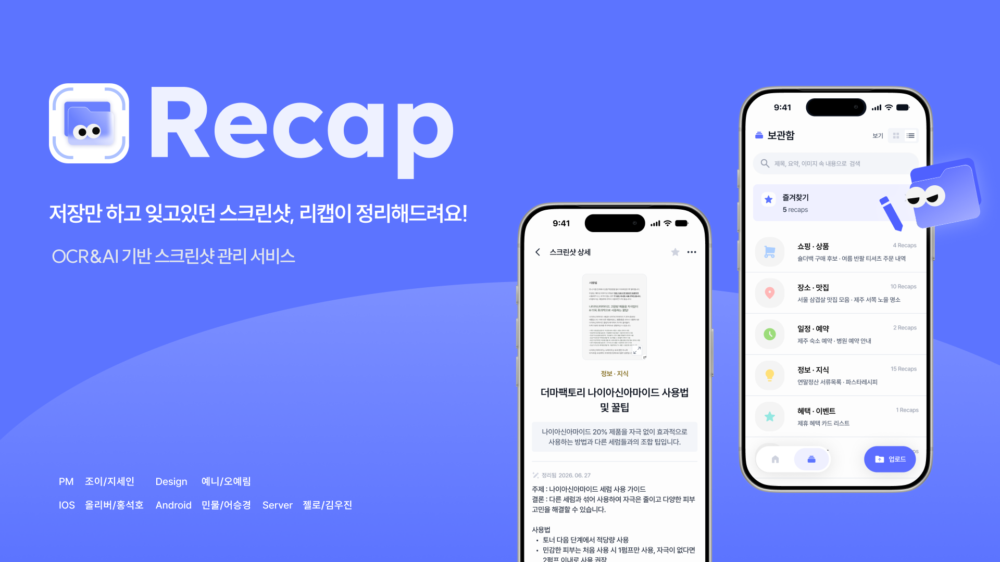
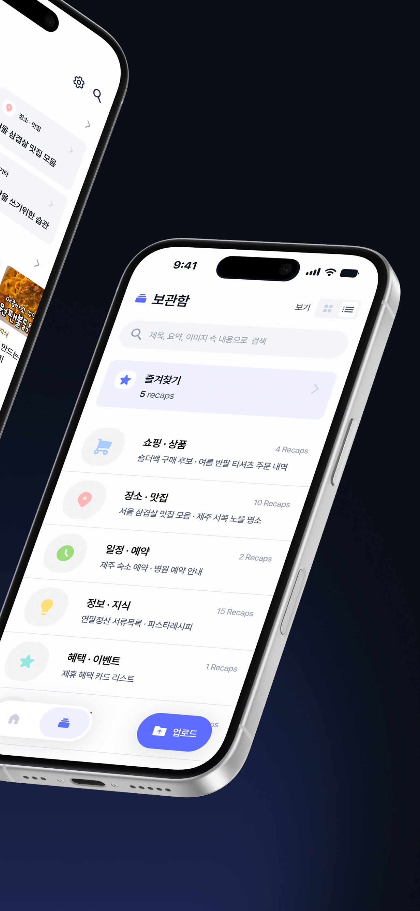
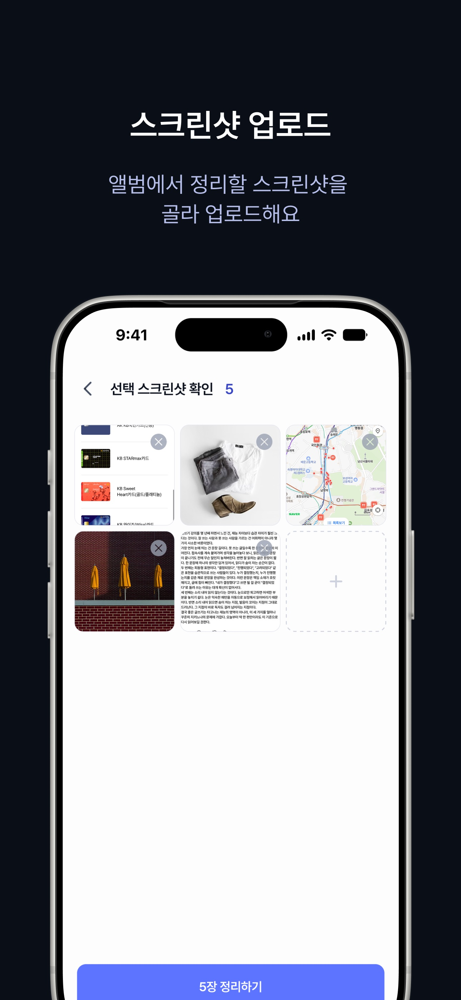
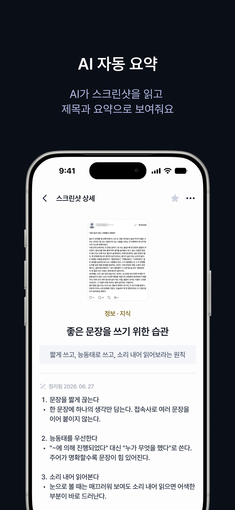
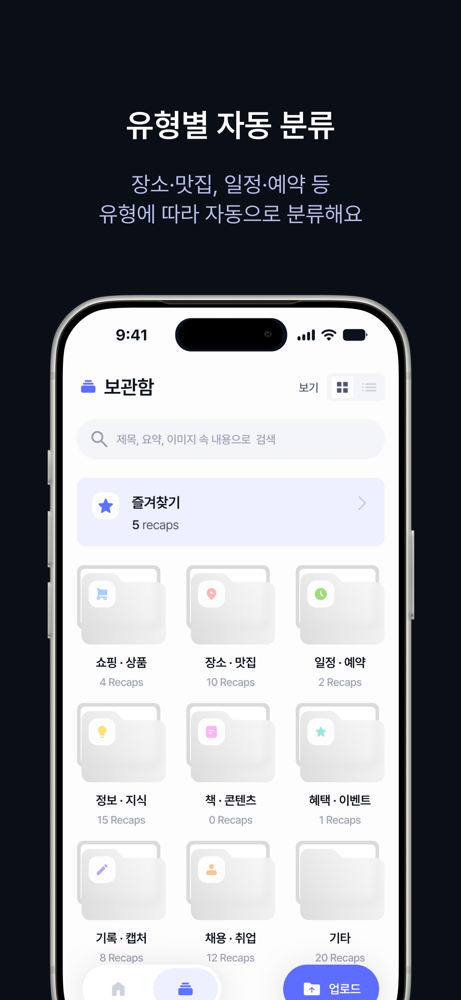
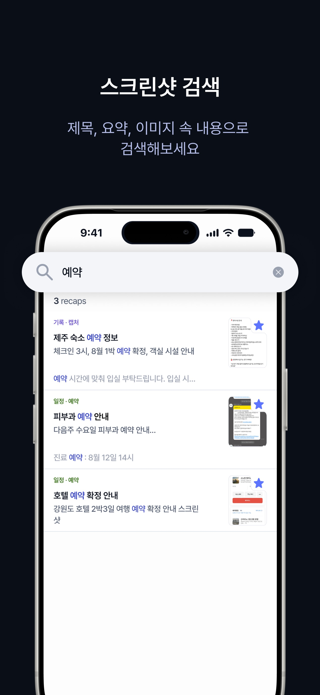
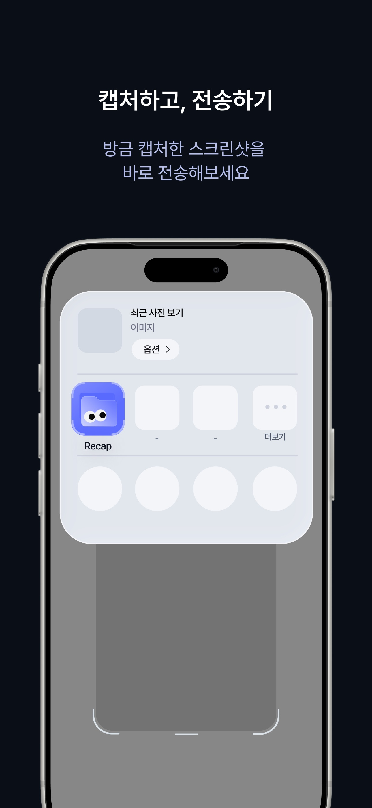

<p align="center">
  
</p>

<h1 align="center">Recap</h1>

<p align="center">
  <strong>앨범에 쌓인 스크린샷, 필요할 때 바로 꺼내 쓰세요.</strong>
</p>

<p align="center">
  Recap은 스크린샷을 AI로 요약하고 분류해<br />
  제목·요약·이미지 속 내용으로 다시 찾을 수 있게 만드는 iOS 앱입니다.
</p>

<p align="center">
  <a href="https://apps.apple.com/us/app/recap-%EC%8A%A4%ED%81%AC%EB%A6%B0%EC%83%B7-%EC%9A%94%EC%95%BD-%EC%A0%95%EB%A6%AC/id6795902468">
    
  </a>
</p>

## 주요 기능

| 기능 | 설명 |
|:--|:--|
| 스크린샷 정리 | 앨범에서 여러 장을 선택해 한 번에 정리할 수 있어요. |
| AI 요약 | 이미지 속 내용을 분석해 제목과 핵심 요약을 만들어요. |
| 자동 분류 | 장소·맛집, 일정·예약, 쇼핑·상품 등 알맞은 유형으로 나눠요. |
| 내용 검색 | 제목과 요약은 물론, 이미지 속 텍스트까지 검색할 수 있어요. |
| 빠른 공유 | 방금 캡처한 화면을 iOS 공유 시트에서 Recap으로 바로 보낼 수 있어요. |

## 미리 보기

<table>
  <tr>
    <td width="33.33%"></td>
    <td width="33.33%"></td>
    <td width="33.33%"></td>
  </tr>
  <tr>
    <td width="33.33%"></td>
    <td width="33.33%"></td>
    <td width="33.33%"></td>
  </tr>
</table>

## 기술 스택

| 영역 | 기술 |
|:--|:--|
| Language | Swift 6 |
| UI | SwiftUI, Lottie, ConfettiSwiftUI |
| Architecture | Feature 중심 구성, 상태 저장소 기반 화면 상태 관리 |
| Navigation | SwiftUI NavigationStack, App Router |
| Async | Swift Concurrency (`async`/`await`) |
| Network | Alamofire, URLSession |
| Auth | Kakao Login, Sign in with Apple |
| Persistence | Keychain, UserDefaults |
| Image | SwiftUI `AsyncImage`, 원본 이미지 확대 보기 |
| Extension | iOS Share Extension, App Group |
| Analysis | 서버 기반 OCR·AI 분석 |
| Test | XCTest |

## 프로젝트 구조

Recap은 메인 앱, 공유 시트 확장, 두 타깃이 함께 쓰는 공통 계층을 분리해 구성했습니다.

```text
Recap/                         # 메인 앱
├── App/                       # 앱 진입점, 라우팅, 세션 상태
├── Features/                  # 화면별 기능
│   ├── Archive/               # 보관함과 유형별 폴더
│   ├── CardCreation/          # 스크린샷 정리
│   ├── CardDetail/            # 상세 조회와 편집
│   ├── Home/                  # 홈
│   ├── Onboarding/            # 온보딩과 로그인
│   ├── Search/                # 검색
│   └── Settings/              # 설정과 데이터 관리
├── Services/                  # 인증, 네트워크, 보안 저장소
├── DesignSystem/              # 공통 컴포넌트와 디자인 토큰
└── Models/                    # 도메인 모델
RecapShareExtension/           # iOS 공유 시트 확장
Shared/                        # 앱과 확장이 공유하는 UI·모델
RecapTests/                    # 단위 테스트
```

- `Recap`과 `RecapShareExtension`은 App Group과 Keychain을 통해 인증 세션을 공유합니다.
- Share Extension은 공통 업로드 파이프라인으로 선택한 스크린샷의 정리를 요청합니다.
- Preview와 테스트를 위한 목 구현을 분리해 실제 서버 연동 없이 화면과 상태를 검증할 수 있습니다.

## 앱 정보

| 항목 | 값 |
|:--|:--|
| Bundle ID | `com.cmc.recap` |
| Deployment Target | iOS 26.0 |
| Swift | 6.0 |
| App Store Version | `1.2.1` |
| Targets | `Recap`, `RecapShareExtension`, `RecapTests` |
| 배포 채널 | [App Store](https://apps.apple.com/us/app/recap-%EC%8A%A4%ED%81%AC%EB%A6%B0%EC%83%B7-%EC%9A%94%EC%95%BD-%EC%A0%95%EB%A6%AC/id6795902468) |

## 문서

| 문서 | 내용 |
|:--|:--|
| [`RELEASE.md`](RELEASE.md) | 버전 관리, 시크릿 설정, 테스트와 App Store 배포 절차 |
| [`Config/Secrets.xcconfig.example`](Config/Secrets.xcconfig.example) | 카카오 네이티브 앱 키 로컬 설정 예시 |
